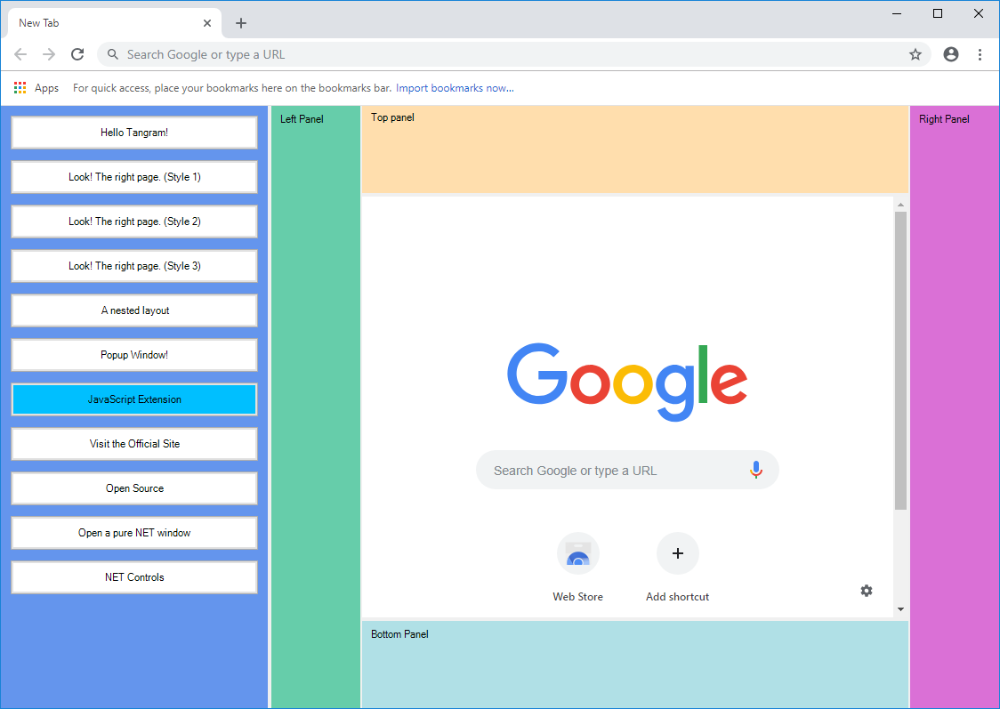

# Tangram

Tangram is a Chromium-based **Hybrid Application Browser**. We have retained the full functionality of Chromium. Support for the development of **Hybrid Cloud Applications** using both Web and Desktop technologies.

## Documentation

- [Learn about the extension panel on the left.](https://github.com/TangramDev/LaunchPad)
- [API Reference](/Docs/API_Reference.md)
- [Customize the launch page.](/Docs/LocalNTP.md)
- [Build and publish your own private Tangram browser.](/Docs/Build_Instructions(Windows).md)
